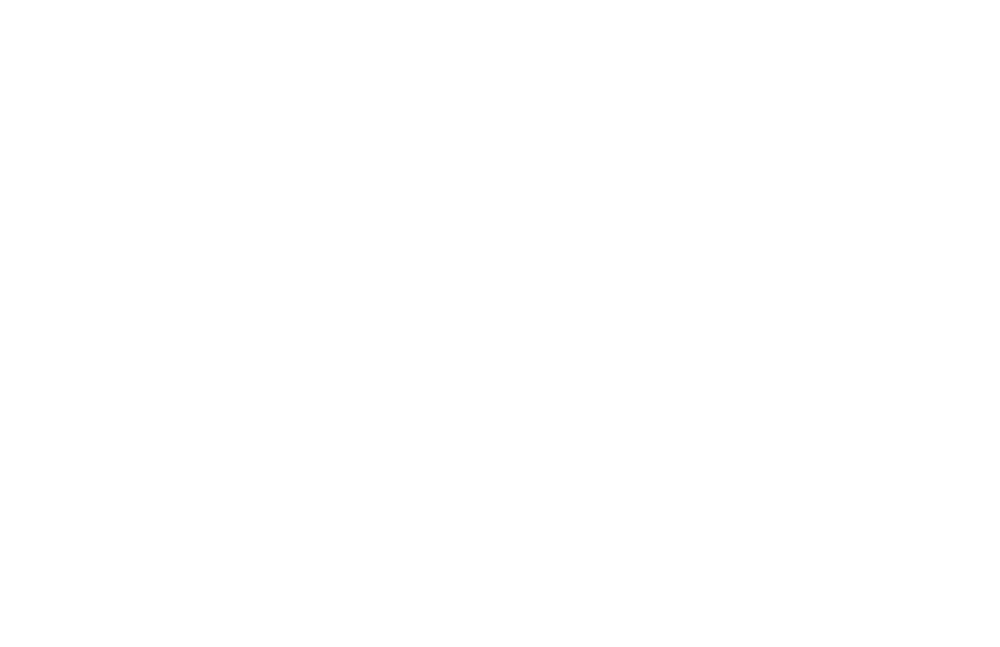

# Anyquery

</img>


[](https://anyquery.dev)
[](https://github.com/julien040/anyquery/issues)
[](https://anyquery.dev/integrations/)
[](https://anyquery.dev/queries)
[](https://pkg.go.dev/github.com/julien040/anyquery/namespace)
[](https://archestra.ai/mcp-catalog/julien040__anyquery)

---

<p align="center">
  <sub><i>Sponsored by</i></sub><br><br>
  <a href="https://www.atlascloud.ai/?utm_source=github&utm_medium=link&utm_campaign=anyquery">
    <picture>
      <source media="(prefers-color-scheme: dark)" srcset="https://cdn.julienc.me/share/atlas-cloud-logo-white.svg">
      
    </picture>
  </a>
</p>

<h3 align="center">
  <a href="https://www.atlascloud.ai/?utm_source=github&utm_medium=link&utm_campaign=anyquery">One AI API for LLMs, image &amp; video generation — 300+ models</a>
</h3>

<p align="center">
  <sub>
    Atlas Cloud is a full-modal AI inference platform: a single API and one account for chat completions,<br>
    image generation, and video generation across 300+ curated models (DeepSeek, FLUX, Kling, Qwen…).<br>
    With the <a href="https://anyquery.dev/integrations/atlascloud">Anyquery plugin</a>, you can call all of them directly from SQL.
  </sub>
</p>

---

Anyquery is a SQL query engine that allows you to run SQL queries on pretty much anything. It supports querying [files](https://anyquery.dev/docs/usage/querying-files/), [databases](https://anyquery.dev/docs/database), and [apps](https://anyquery.dev/integrations) (e.g. Apple Notes, Notion, Chrome, Todoist, etc.). It's built on top of [SQLite](https://www.sqlite.org) and uses [plugins](https://anyquery.dev/integrations) to extend its functionality.

It can also connect to [LLMs](https://anyquery.dev/llm) (e.g. ChatGPT, Claude, Cursor, TypingMind, etc.) to allow them to access your data.

Finally, it can act as a [MySQL server](https://anyquery.dev/docs/usage/mysql-server/), allowing you to run SQL queries from your favorite MySQL-compatible client (e.g. [TablePlus](https://anyquery.dev/connection-guide/tableplus/), [Metabase](https://anyquery.dev/connection-guide/metabase/), etc.).


## Usage

### Connecting LLM

LLMs can connect to Anyquery using the [Model Context Protocol (MCP)](https://anyquery.dev/docs/reference/commands/anyquery_mcp). This protocol provides context for LLMs that support it. You can start the MCP server with the following command:

```bash
# To be started by the LLM client
anyquery mcp --stdio
# To connect using an HTTP and SSE tunnel
anyquery mcp --host 127.0.0.1 --port 8070
```

You can also connect to clients that supports function calling (e.g. ChatGPT, TypingMind). Refer to each [connection guide](https://anyquery.dev/integrations#llm) in the documentation for more information.

```bash
# Copy the ID returned by the command, and paste it in the LLM client (e.g. ChatGPT, TypingMind)
anyquery gpt
```


### Running SQL queries

The [documentation](https://anyquery.dev/docs/usage/running-queries) provides detailed instructions on how to run queries with Anyquery.
But let's see a quick example. Type `anyquery` in your terminal to open the shell mode. Then, run the following query:


You can also launch the MySQL server with `anyquery server` and connect to it with your favorite MySQL-compatible client.

```bash
anyquery server &
mysql -u root -h 127.0.0.1 -P 8070
```

## Installation

The [documentation](https://anyquery.dev/docs/#installation) provides detailed instructions on how to install Anyquery on your system. You can install anyquery from Homebrew, APT, YUM/DNF, Scoop, Winget and Chocolatey. You can also download the binary from the [releases page](https://github.com/julien040/anyquery/releases).

### Homebrew

```zsh
brew install anyquery
```
<!-- 
### Snap

```bash
sudo snap install anyquery
``` -->
### ARCH LINUX (AUR)

```bash
# Install using an AUR helper like yay
yay -S anyquery-git

# paru
paru -S anyquery-git
```

### APT

```bash
echo "deb [trusted=yes] https://apt.julienc.me/ /" | sudo tee /etc/apt/sources.list.d/anyquery.list
sudo apt update
sudo apt install anyquery
```

### YUM/DNF

```bash
echo "[anyquery]
name=Anyquery
baseurl=https://yum.julienc.me/
enabled=1
gpgcheck=0" | sudo tee /etc/yum.repos.d/anyquery.repo
sudo dnf install anyquery
```

### Scoop

```powershell
scoop bucket add anyquery https://github.com/julien040/anyquery-scoop
scoop install anyquery
```

### Winget

```powershell
winget install JulienCagniart.anyquery
```

### Chocolatey

```powershell
choco install anyquery
```

### Go install

Requires Go 1.26+ (some dependencies don't support older versions).

```bash
CGO_ENABLED=1 go install -tags "vtable fts5 sqlite_json sqlite_math_functions" github.com/julien040/anyquery@main
```

Anyquery relies on cgo (through go-sqlite3), so you need a C compiler (gcc, clang, or a mingw toolchain on Windows) available in your `PATH`.

## Plugins

Anyquery is plugin-based, and you can install plugins to extend its functionality. You can install plugins from the [official registry](https://anyquery.dev/integrations) or create your own. Anyquery can also [load any SQLite extension](https://anyquery.dev/docs/usage/plugins#using-sqlite-extensions).


## Sponsors

Anyquery is an independent open-source project. These companies support its development:

<a href="https://www.atlascloud.ai/?utm_source=github&utm_medium=link&utm_campaign=anyquery">
  
</a>

[Become a sponsor](https://github.com/sponsors/julien040)

## License

Anyquery is licensed under the AGPLv3 license for the core engine. The RPC library is licensed under the MIT license so that anyone can reuse plugins in different projects.

The plugins are not subject to the AGPL license. Each plugins has its own license and the copyright is owned by the plugin author.
See the [LICENSE](https://github.com/julien040/anquery/blob/main/LICENSE.md) file for more information.

## Contributing

If you want to contribute to Anyquery, please read the [contributing guidelines](https://anyquery.dev/docs/developers/project/contributing). I currently only accept minor contributions, but I'm open to any suggestions or feedback.

You can have a brief overview of the project in the [architecture](https://anyquery.dev/docs/developers/project/architecture/) documentation.
